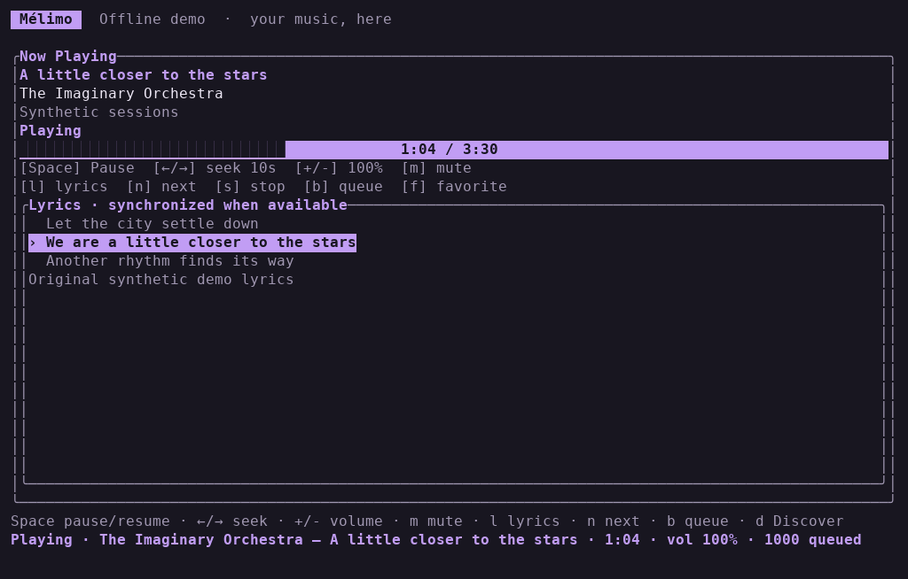

# Mélimo

A streaming-only music player for your terminal, written in Rust.
Search, explore playlists, build a queue and follow synchronized lyrics from the keyboard.

**Version:** `0.1.0`. Linux and macOS are the initial targets.



## Features

- Deezer track and playlist search, personal playlists, favorites and Flow.
- Invidious audio search with automatic instance discovery and audio throughput selection.
- MP3 and AAC/M4A playback, pause/resume, volume/mute, mixed queue, shuffle and next track.
- Progress display and 10-second backward/forward seeking.
- Line-synchronized lyrics when available, with plain-text fallback and credits.
- Dark plum, light and monochrome themes; compact player controls.
- Offline metadata demo, hidden login prompt and optional local session storage.

Mélimo is an **unofficial client**, not affiliated with Deezer or Invidious. Deezer
requires your own account and access to the tracks you play. Invidious uses anonymous
Invidious API requests. Provider behavior can change without
notice; streaming-only does not imply official API support.

## Install

Install current stable Rust. On Debian/Ubuntu, install the audio build dependencies:

```sh
sudo apt-get install libasound2-dev pkg-config
```

On macOS, install Xcode Command Line Tools (`xcode-select --install`). Then:

```sh
git clone https://github.com/JeremySomsouk/Melimo.git
cd Melimo
cargo install --locked --path .
melimo --mock
```

Playback needs an interactive terminal and an audio output device. The mock demo
uses fictional metadata, makes no network requests and does not play audio.
Windows is not a validated release target; credential persistence is disabled
outside Unix until equivalent file-access protections are implemented.

## Sign in

```sh
melimo --login
```

Sign in on Deezer's own page, then copy the `arl` cookie from browser DevTools
(Application/Storage → Cookies → `https://www.deezer.com`) into the hidden terminal
prompt. Mélimo never asks for your Deezer password or reads the browser cookie store.

**Treat the ARL like a password.** Never paste it into an issue, chat, screenshot,
command-line argument or committed file. After authentication succeeds, Mélimo can
save it locally. It is a plaintext credential protected by filesystem permissions,
not an encrypted keychain entry.

| Option | Behavior |
| --- | --- |
| `melimo` | Use `DEEZER_ARL`, then the saved login |
| `melimo --login` | Explicit interactive login; save only after successful authentication |
| `melimo --check-auth` | Check login without the TUI or displaying account details |
| `melimo --forget` | Remove the saved login |
| `MELIMO_NO_STORE=1 melimo --login` | Use a login for this process only; do not read/write saved credentials |

`DEEZER_ARL` is never automatically saved. To supply it in Bash without putting its
value in shell history:

```bash
read -rsp 'Deezer ARL: ' DEEZER_ARL
printf '\n'
export DEEZER_ARL
melimo
unset DEEZER_ARL
```

A saved login lives in `~/Library/Application Support/melimo/session` on macOS,
or `$XDG_DATA_HOME/melimo/session` (default `~/.local/share/melimo/session`) on Linux.
The directory must be owner-only (`0700`) and the regular file owner-only (`0600`).
Unsafe permissions, symlinks, hard-linked credentials and oversized files are refused.
A saved login explicitly rejected at startup is removed; transient network failures
leave it intact. A failed interactive replacement preserves the previous login.

## Invidious audio

Invidious is enabled by default. Run `melimo --invidious` without configuration.
On first use, Mélimo fetches HTTPS API candidates from the official instance
registry and caches them for ten minutes. Discovery never blocks Deezer startup.
Search retries available candidates with a four-second timeout per instance.
Before playback, up to three instances deliver a small audio sample concurrently;
the fastest measured delivery is retained and continues directly into playback.
This measures current delivery to your connection, not a guaranteed maximum
bandwidth. Probes have a six-second deadline and bounded buffers. Failed instances
are removed from the cache. A failure after playback starts is reported for retry;
audio from different instances is never concatenated mid-track.

Optional settings go in `$XDG_CONFIG_HOME/melimo/config.toml` (default
`~/.config/melimo/config.toml`) or the file named by `MELIMO_CONFIG`:

```toml
[invidious]
enabled = true
# Optional override; omit for automatic discovery:
# invidious_instance = "https://example.invalid"
```

An explicit instance bypasses discovery and comparison probes. HTTP is supported
for locally hosted instances. Credentials, query strings and fragments are rejected
in the instance setting; path prefixes are supported. Use `enabled = false` to
disable the provider. The provider CLI flag and configuration section are now
`--invidious` and `[invidious]`; update older configurations accordingly.

Run `melimo --invidious` for anonymous Invidious-only playback; this mode does not
read Deezer credentials or require login. With a Deezer login and Invidious enabled,
run `melimo` for both providers. Press `P` outside text entry to switch search
provider, then `/`, a query, and `Enter`. Search results and the queue show `[DZR]`
or `[INV]`. Select a result and press `Enter` to play; `e` adds it to the queue.
Provider switches and searches preserve the playing item and queue. `b` opens the
queue; `Enter` there starts playback from the selected entry. `Space`, arrows,
`n`, `s`, volume and mute work through the same player for both providers.

This milestone supports recorded videos with an audio-only **AAC-LC/M4A** stream.
It selects the highest advertised bitrate among supported formats. Opus/WebM-only,
live and upcoming videos are not supported. Search omits live/upcoming entries;
metadata lookup rejects videos that become unavailable or unsupported. An expired
or denied audio URL triggers one fresh metadata lookup before any audio is sent;
a second failure is shown in the player. Select the result again to retry.
Seeking resolves a fresh stream and decodes forward from the start, so long seeks
can buffer and use extra bandwidth. Stop clears the queue, as in Deezer mode.

No Invidious login, cookies, browser player, advertising UI, yt-dlp or ffmpeg is
needed at runtime. AAC decoding is compiled into the existing Rodio player.
Metadata requests ask for proxied media URLs with `local=true`. The instance and
returned media hosts receive network requests; availability,
rate limits and regional access depend on that infrastructure. Errors never echo
raw responses or signed audio URLs. No audio is saved to disk.

Deezer discovery, playlists, favorites and lyrics remain Deezer capabilities.
Invidious starts on search; `d` returns to search, and `q`/`Esc` from that screen exits.
`Tab` explains that Invidious playlists are not yet available. Combined search,
playlists, resolver fallback, opt-in SponsorBlock and video remain future work in
[next steps](docs/NEXT_STEPS.md).

## Find and play music

Deezer starts on **Discover**. Choose a genre or mood to search playlists, inspect one with
`Enter`, then play a track or press `a` for the displayed set. `d` returns to browsing
while playback continues. `/` edits search; `Tab` changes track/playlist search when
not typing.

**Familiar** loads favorites. **For you** loads a batch of Flow recommendations.
**Discover** excludes the first 1,000 favorites from Flow; it does not guarantee
never-heard songs. Genre/mood shortcuts are playlist keyword searches, not
personalized genre filters.

`p` opens the player; `l` toggles lyrics. Seeking restarts the stream and decodes
forward in bounded memory, so it can buffer and uses extra network traffic.
The queue and pause state are preserved. Lyrics highlight whole lines, not individual
words, and do not remove vocals. Missing lyrics never prevent playback.

## Controls

| Key | Action |
| --- | --- |
| `j/k`, `↑/↓`, `g/G` | Select / first / last |
| `Enter` | Browse, inspect playlist or play selected track |
| `a`, `r` | Play all / shuffle and play |
| `p`, `b` | Player / upcoming queue |
| `e`, `Delete` | Enqueue selected track / remove queued track |
| `Space`, `n`, `s` | Pause/resume / next / stop and clear queue |
| `+/-`, `m` | Volume in 5% steps / mute |
| `←/→` in player | Seek backward/forward 10 seconds |
| `l` | Lyrics/karaoke |
| `f` | Add/remove selected or current song from **your Deezer favorites** |
| `L` | Refresh login; stops playback and clears the queue |
| `d`, `/`, `Tab` | Discover (Invidious: search) / edit search / change Deezer search type |
| `P` | Switch search provider outside text entry |
| `Backspace`, `Ctrl+U` | Delete character / clear search |
| `?` | Help |
| `q`, `Esc` | Back; quit from Discover or Invidious search |
| `Ctrl+C` | Quit |

New searches preserve the queue. Enter on a queued song skips earlier entries.
Playback errors halt automatic progression; `n` explicitly skips the failed song.

## Appearance

```sh
MELIMO_THEME=dark melimo    # default
MELIMO_THEME=light melimo
MELIMO_THEME=mono melimo    # inherit terminal colors
```

A nonempty `NO_COLOR` takes precedence. Themes are read once at startup. A width
of 40 columns is the compact minimum for usable player controls; larger windows
show more metadata and lyrics. Terminals smaller than that remain safe to resize.

## Privacy and limitations

- No audio download/export, telemetry or listening-history log. Audio and lyrics
  stay in memory; OS swap/core dumps are outside that guarantee.
- The only intentional user-data write is the optional saved login and its temporary
  file during atomic replacement. Storage permissions do not protect against other
  processes running as you, administrators, backups or compromised machines.
- ARL cookies go only to the fixed HTTPS Deezer gateway. Media authorization uses
  a fixed HTTPS endpoint; audio URLs are restricted to Deezer/CDN hosts. Redirects
  are disabled and errors omit raw provider responses and credential-bearing URLs.
- Deezer search returns up to 50 results. Playlist/favorite sets cap at 1,000 tracks.
  Flow is a finite batch, not an endlessly replenished radio. Invidious uses the
  first Invidious search page, bounded by a 2 MiB API response limit.
- No previous-track control, persistent queue, alternate quality or browser player.
- Now-playing metadata appears in the terminal title, so it can be visible in
  desktop screenshots or terminal integrations.

See [security](SECURITY.md), [release validation](docs/RELEASE.md) and
[protocol references](docs/REFERENCES.md).

## Development

```sh
cargo fmt --check
cargo clippy --locked --all-targets --all-features -- -D warnings
cargo test --locked
cargo build --locked --release
```

Tests use synthetic HTTP responses, invented lyrics and a generated tone; they do
not need a Deezer account or a live Invidious instance. CLI tests disable saved-login access. Optional checks:

```sh
cargo test --locked --release synthetic_render_review -- --ignored --nocapture
cargo test --locked audio_device -- --ignored --test-threads=1
```

The first measures rendering with synthetic metadata and a 1,000-track queue.
The second plays short generated MP3 and AAC tones through the default output device.
Neither proves live Deezer playback or lyric timing; the release checklist covers that.

The TUI and state live in `src/tui` and `src/app`; provider operations are cancellable
Tokio tasks. Separate network, decoder and audio workers communicate through bounded
encoded-audio/PCM channels. Display updates follow elapsed seconds and lyric-line changes;
audio never waits for a terminal redraw.

`Track` carries explicit `ProviderId` identity; it is shared by search, playback
and queue snapshots. `Providers` routes operations by that identity, with
`MusicProvider` retaining provider-specific discovery capabilities. Invidious
metadata and the `StreamResolver` boundary are separate from byte transport;
resolved URLs are ephemeral and never stored in queued items. This allows a
future optional resolver fallback without changing the player. The common
playback clock and seek actions are the future integration point for optional
segment skipping; no speculative segment service is included now.

Next: provider follow-ups and investigation of a shared Rust core/web prototype. See [next steps](docs/NEXT_STEPS.md).
Contributions should stay focused and never include account responses, cookies or
personal test fixtures.

## License

[MIT](LICENSE). See the protocol reference notes for third-party attribution.
